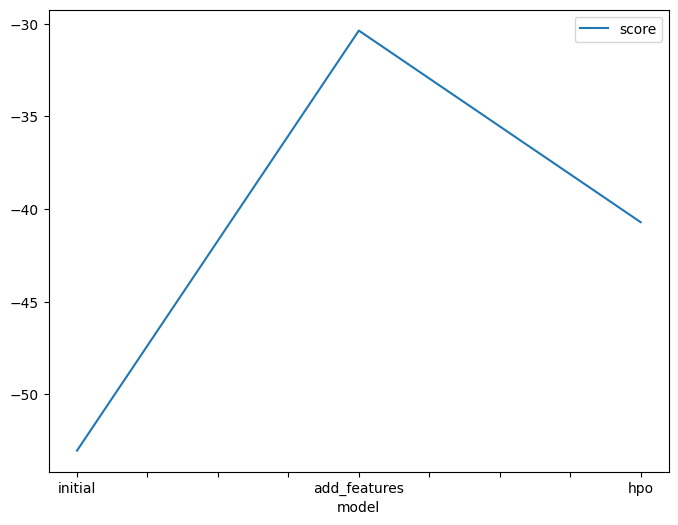
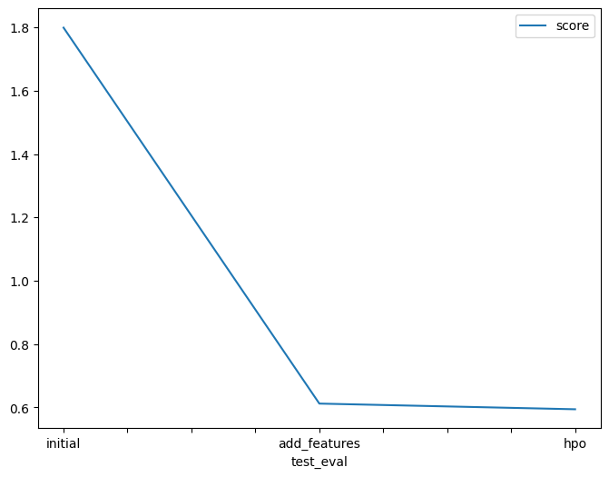

# Report: Predict Bike Sharing Demand with AutoGluon Solution
#### HOANG ANH QUOC LE

## Initial Training
### What did you realize when you tried to submit your predictions? What changes were needed to the output of the predictor to submit your results?
The model was fed with raw data on the first attempt which decreased its performance. Thus, data preprocessing and feature engineering should be done. Moreover, because the number of bikes rented (the target variable) is supposed to be non-negative number, all negative predictions need to be replaced by zero.

### What was the top ranked model that performed?
WeightedEnsemble_L3 was the top ranked model in every entry.

## Exploratory data analysis and feature creation
### What did the exploratory analysis find and how did you add additional features?
Following the exploratory data analysis, it was found that I needed to featurize the datetime column and transform the season and weather features to categorical data type. When featurizing the datetime column, I parsed the column into month, day, year and hour, resulting in additional features for the dataset.

### How much better did your model preform after adding additional features and why do you think that is?
Thanks to additional features, the model was then greatly improved, with the error score reduced by approximately 66%. In my opinion, feature engineering has enhanced dataset and thus, has increased the accuracy of a model. Generally, it modifies or extends the current features in a dataset with additional insights or data.

## Hyper parameter tuning
### How much better did your model preform after trying different hyperparameters?
After tuning hyperparameters, the model's preformance was slightly better. The error rate went from 0.61217 down to 0.59427. In some circumstances, the newly tuned hyperparameters can lead to a downgrade in model performance or even harm the model's overall effectiveness.

### If you were given more time with this dataset, where do you think you would spend more time?
I would delve deeper into the EDA process, visualizing and analyzing different aspects of the data to uncover hidden patterns or trends that could further inform feature engineering or data preprocessing.

### Create a table with the models you ran, the hyperparameters modified, and the kaggle score.
|model|hpo1|hpo2|hpo3|score|
|--|--|--|--|--|
|initial|default|default|default|1.79979|
|add_features|default|default|default|0.61217|
|hpo|FASTAI: layers=[100, 50]|FASTAI: emb_drop=0.2|GBM: num_boost_round=50|0.59427|

### Create a line plot showing the top model score for the three (or more) training runs during the project.

### Create a line plot showing the top kaggle score for the three (or more) prediction submissions during the project.

## Summary
In this project, I have applied feature engineering and data preprocessing, and witnessed their impact on the model in practice. I also was able to develop a machine learning regression model by using the AutoGluon framework.